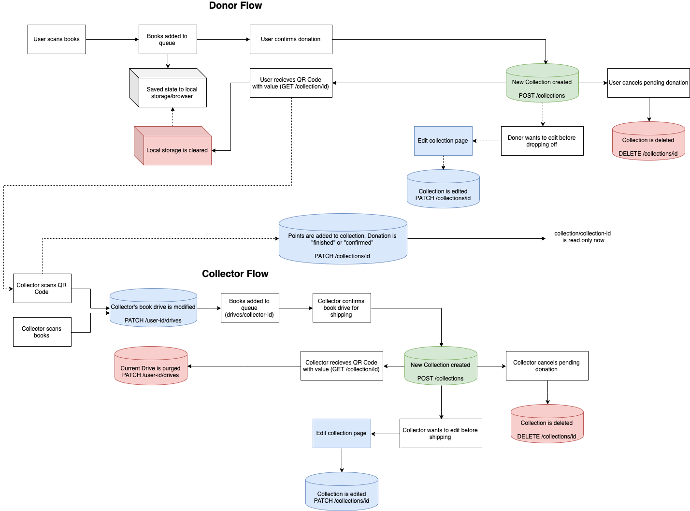

# Kitabu *(Client-site)*
Kitabu is a seamless digital portal to donate, collect and catalogue books. The platform makes it easy for collectors to scan QR codes and catalogue donations, and donors recieve points for every book that they donate. Kitabu was created for the African Library Project hackathon.

[Link to Site](https://kitabu-client.vercel.app/)

## Purpose
- Broaden ALP's donor and collector base through a digtal portal 
- Develop an incentivized, points-based donation process that facilitates consistent use
- Create a seamless donation system for new and returning donors
- Create a seamless cataloguing experience for collectors that can be expanded to librarians
- Help donors and collectors visualize the impact of their donations
- Make donating easier during COVID-19 by digitizing the donation process
- Bring awareness to black owned businesses
- Generate socially conscious partnerships that further strengthen incentive/point system
  

## User Stories

#### Before building the app, we came up with rough user stories to inform the development. Below are some of our notes:

#### As a donor...
    - I want to scan books on my browser
    - I can list the condition of each book I donate
    - I can create a ticket logging my donation batch (i.e. list of books they'll be sending out)
    - I can view where to drop off the books to based on my location
    - I can select who to give to
    - I can see past books I've sent and points I've accumulated, and the status of each donation
    - I can show the collector a QR code with my donation
    - I can see other information near the QR code detailing  the name of the collector, their address, business hours and phone number for help
    
#### As a collection partner...
    - I can recieve tickets of users donating books via QR code which adds their donation to my queue
    - I can add my whole queue into my shipping box in one button
    - I can create shipping details out of my donations that has a QR code to scan the whole inventory
    - I can approve and deny donations based on their condition
    - I can add individual books to my shipping list if I want to ship a collection
    - I can log out and log back in to view my saved queue in case I want to revisit later
    - Shipped books are deleted from my queue
  

### *With the user stories outlined, we sketched out a preliminary diagram to determine how data is passing through the platform*

# For the future
We built Kitabu to be scalable. For example, the collector model can eventually be extended to a librarian, where they may scan QR shipment codes to catalogue all books within a box to avoid having to write down the books manually. 

Collectors may eventually also have points for every collection that gets successfully scanned by a library in Africa. Kitabu is meant to facilitate a self-sustaining donation and point system that encourages both donors and collectors to donate and host book drives.

  

# Technology Used
- MongoDB
- Express.js
- Node.js
- React.js
- Barcode Scanner
- Google Books API

Here's a 
[link](https://github.com/gonsaje/Kitabu) to the Kitabu API repo.
